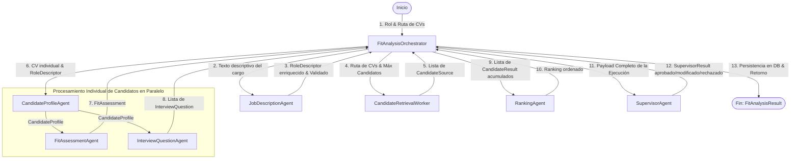

```
Equipo
- Evelyn Andaur 
- Gustavo Mendoza 
- Julio Morales
```


### Instala entorno Virtual
```bash
python3 -m venv .venv
source .venv/bin/activate
pip install -r fit_analysis_orchestrator/requirements.txt
```


### Variables de entorno, configuras tus claves
```bash
cp .env.example .env
```


```
Agrega los CV al directorio ./cvs 

SUPPORTED_CV_EXTENSIONS = {".txt", ".md", ".pdf", ".docx"}

El archivo cvs/juan_perez.txt, es un ejemplo.
```


### Ejecucion basica
```bash
python -m fit_analysis_orchestrator.agent --cv-dir ./cvs --role-text "Se busca Ingeniero de Datos con experiencia en Python y SQL" --max-candidates 3
```

### Usar Docker para funcionalidad basica WEB
```bash
docker build -t multiagentecv:latest .

docker run --rm -p 8080:8080 --env-file .env multiagentecv:latest

docker run --rm -p 8080:8080 -e OPENAI_API_KEY="tu_api_key_aquí" multiagentecv:latest
```

```
http://localhost:8080/docs
Desde ahí puedes interactuar con el sistema:

Indexar los CVs de la carpeta:
Busca la sección POST /index-cvs.
Haz clic en "Try it out" (Pruébalo) y luego en "Execute" (Ejecutar) para procesar e indexar tus CVs.
Ejecutar el Análisis Multiagente:
Busca la sección POST /analyze.
Haz clic en "Try it out".
Modifica el cuerpo del JSON con la descripción del rol que desees buscar, por ejemplo:
json
{
  "role_description": "Se busca Ingeniero de Datos con experiencia en Python y SQL",
  "top_k_candidates": 3
}
Haz clic en "Execute" para ver los resultados de compatibilidad procesados por los agentes y aprobados por el supervisor.
```


Flujo de información Agentes, workers coordinados por el **Orquestador (`FitAnalysisOrchestrator`)**:

---

### Diagrama del Flujo de Información



---

### Detalle de Entrada, Procesamiento y Salida por Componente

#### 1. Entrada Principal del Sistema
El usuario suministra al **Orquestador**:
* El texto libre del descriptivo del rol.
* La ruta del directorio de currículums (`./cvs`).
* Configuración de ponderaciones/pesos de evaluación.
* Cantidad máxima de candidatos a procesar.

---

#### 2. Agente Analizador del Rol (`JobDescriptionAgent`)
* **Input (Entrada):** Texto plano del rol.
* **Procesamiento:** Estructura el rol identificando responsabilidades, requisitos obligatorios/deseables, tecnologías, herramientas y certificaciones.
* **Output (Salida):** Un modelo estructurado de rol (`RoleDescriptor`) con indicador de validez (`validated`).
* **Decisión del Orquestador:** Si la descripción de cargo es muy corta o insuficiente, el Orquestador la marca como inválida y detiene el proceso temprano (Rechazo).

---

#### 3. Recuperador de Candidatos (`CandidateRetrievalWorker`)
* **Input:** Ruta de la carpeta de CVs y límite máximo de candidatos.
* **Procesamiento:** Lee los archivos de currículums (`.txt`, `.pdf`, `.docx`) en la carpeta y filtra los formatos no soportados.
* **Output:** Lista de objetos `CandidateSource` que contienen el ID de cada candidato, el nombre y la ruta al archivo.

---

#### 4. Procesamiento Individual de Candidatos (En Paralelo)
Para cada candidato recuperado, el Orquestador gestiona concurrentemente un subflujo de tres agentes:

* **A. Agente de Perfilado (`CandidateProfileAgent`):**
  * **Input:** El archivo fuente del CV (`CandidateSource`) y la descripción estructurada del rol.
  * **Output:** Un perfil unificado (`CandidateProfile`) con la información laboral estructurada, años de experiencia total y evidencias textuales del CV de cada tecnología o competencia encontrada.

* **B. Agente de Evaluación (`FitAssessmentAgent`):**
  * **Input:** El perfil generado en el paso anterior (`CandidateProfile`) y las ponderaciones configuradas.
  * **Output:** Una evaluación de compatibilidad (`FitAssessment`) que detalla el puntaje final de ajuste (fit percentage), cumplimiento de requisitos obligatorios y alertas en caso de que incumpla algún requisito excluyente.

* **C. Agente de Preguntas de Entrevista (`InterviewQuestionAgent`):**
  * **Input:** El perfil del candidato (`CandidateProfile`) y el descriptivo de cargo.
  * **Output:** Un set de hasta 5 preguntas estructuradas (`InterviewQuestion`) diseñadas a la medida para indagar en las brechas, dudas técnicas o puntos débiles detectados en la evaluación.

---

#### 5. Agente de Clasificación (`RankingAgent`)
* **Input:** Los resultados acumulados de todos los candidatos evaluados (perfiles, fits y preguntas).
* **Procesamiento:** Analiza el porcentaje de fit de todos los postulantes y los ordena de mayor a menor compatibilidad, considerando además penalizaciones por requisitos excluyentes no cumplidos.
* **Output:** Un listado consolidado y ordenado (`ranking`).

---

#### 6. Agente Supervisor (`SupervisorAgent`)
* **Input:** Un payload masivo que contiene toda la información generada en la ejecución (el descriptivo del rol, los perfiles de los candidatos, sus preguntas de entrevista, la matriz de compatibilidad, el ranking propuesto y las trazas de ejecución).
* **Procesamiento:** Actúa como auditor de calidad del sistema. Revisa si hay contradicciones (por ejemplo, que el ranking no refleje las notas de compatibilidad), si faltan datos obligatorios, o si hay problemas de seguridad e inconsistencias.
* **Output:** Un veredicto (`SupervisorResult`) con uno de estos tres estados:
  1. `approved`: Todo es correcto, el resultado es liberado.
  2. `modified_and_approved`: El resultado es liberado, pero se aplican advertencias o modificaciones menores sugeridas por el supervisor.
  3. `rejected`: El análisis no cumple con la calidad mínima de datos y se descarta indicando los motivos.

---

#### 7. Persistencia y Retorno
El Orquestador toma la decisión final del Supervisor, consolida las estadísticas de ejecución (tiempo empleado, tokens consumidos por modelo y trazas detalladas), guarda la información en la base de datos SQLite y retorna el modelo final estructurado al usuario.