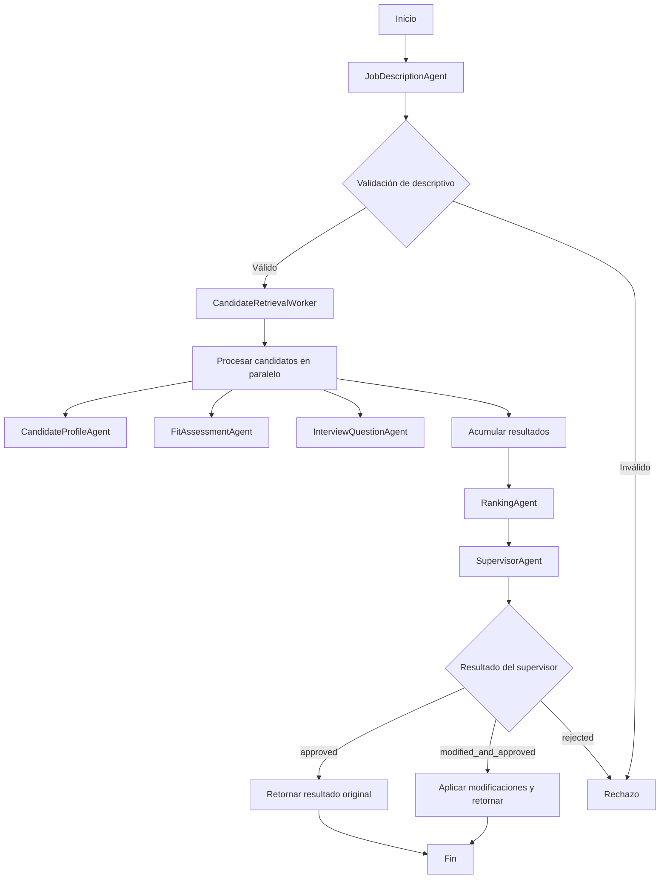

# FitAnalysisOrchestrator

Orquesta el análisis de compatibilidad entre un descriptivo de cargo y múltiples CV almacenados en un directorio.

## Flujo



## Uso

```bash
python agent.py --role-text "Descriptivo de cargo..." --cv-dir ./cvs --max-candidates 5 --weights '{"technical": 0.7}'
```

## DocumentIngestionService

El servicio `DocumentIngestionService` procesa archivos de curriculum en un directorio local y extrae contenido estructurado de PDF, DOCX y TXT.

Ejemplo de uso:

```python
from fit_analysis_orchestrator.document_ingestion import DocumentIngestionService

service = DocumentIngestionService()
results = service.ingest_directory("./cvs")
for doc in results:
    print(doc.source_file, doc.status, doc.page_count)
```

## DocumentChunkingService

El servicio `DocumentChunkingService` toma documentos procesados por `DocumentIngestionService` y los divide en fragmentos optimizados para embeddings y búsqueda semántica.

Las configuraciones se pueden ajustar mediante variables de entorno:

- `DOCUMENT_CHUNK_SIZE`
- `DOCUMENT_CHUNK_OVERLAP`

Ejemplo de uso:

```python
from fit_analysis_orchestrator.document_chunking import DocumentChunkingService
from fit_analysis_orchestrator.document_ingestion import DocumentIngestionService

ingestion = DocumentIngestionService()
documents = ingestion.ingest_directory("./cvs")
chunker = DocumentChunkingService(chunk_size=200, chunk_overlap=50)
chunks = chunker.chunk_documents(documents)
for chunk in chunks:
    print(chunk.chunk_id, chunk.chunk_index, len(chunk.content.split()))
```

## EmbeddingService

El servicio `EmbeddingService` genera embeddings para los chunks creados por `DocumentChunkingService` usando OpenAI.

Configuraciones disponibles:

- `OPENAI_API_KEY`
- `OPENAI_EMBEDDING_MODEL`
- `EMBEDDING_BATCH_SIZE`
- `EMBEDDING_CONCURRENCY`

Ejemplo de uso:

```python
from fit_analysis_orchestrator.embedding_service import EmbeddingService
from fit_analysis_orchestrator.document_chunking import DocumentChunkingService
from fit_analysis_orchestrator.document_ingestion import DocumentIngestionService

ingestion = DocumentIngestionService()
documents = ingestion.ingest_directory("./cvs")
chunker = DocumentChunkingService(chunk_size=200, chunk_overlap=50)
chunks = chunker.chunk_documents(documents)
embedder = EmbeddingService(model="text-embedding-3-large", batch_size=16, concurrency=2)
embeddings = asyncio.run(embedder.generate_embeddings(chunks))
for record in embeddings:
    print(record.chunk_id, record.status)
```

## CVIndexingPipeline

El componente `CVIndexingPipeline` procesa un directorio de CV, indexa los fragmentos en ChromaDB y devuelve un resumen estructurado.

Ejemplo de uso:

```python
import asyncio
from fit_analysis_orchestrator.cv_indexing_pipeline import CVIndexingPipeline, CVIndexingRequest

pipeline = CVIndexingPipeline()
request = CVIndexingRequest(cv_directory="./cvs", force_reindex=True)
summary = asyncio.run(pipeline.index(request))
print(summary.json(indent=2, ensure_ascii=False))
```

El pipeline ejecuta:

1. `DocumentIngestionService` para leer archivos.
2. `DocumentChunkingService` para crear chunks.
3. `EmbeddingService` para generar embeddings.
4. `ChromaVectorRepository` para almacenar los fragmentos en Chroma.

Configuraciones adicionales:

- `CHROMA_PERSIST_DIRECTORY`
- `OPENAI_API_KEY`
- `OPENAI_EMBEDDING_MODEL`

## API REST

Se agregó un servicio REST basado en FastAPI para exponer:

- `GET /health` — estado de la aplicación.
- `GET /ready` — verificación de disponibilidad de la base de datos y Chroma.
- `POST /index-cvs` — indexa CVs desde un directorio local.
- `POST /analyze` — ejecuta el `FitAnalysisOrchestrator` y persiste resultados.
- `GET /analyses/{analysis_id}` — consulta un análisis guardado.
- `GET /analyses/{analysis_id}/ranking` — obtiene solo la clasificación del análisis.

Ejemplo de ejecución local:

```bash
uvicorn fit_analysis_orchestrator.api:app --host 0.0.0.0 --port 8000
```

## Docker y Cloud Run

Se agregó soporte para ejecutar el proyecto con Docker y desplegarlo en Google Cloud Run.

### Construir la imagen Docker

```bash
docker build -t multiagentecv:latest .
```

### Ejecutar localmente con Docker

```bash
docker run --rm -p 8080:8080 \
  -e OPENAI_API_KEY=your_api_key_here \
  -e OPENAI_EMBEDDING_MODEL=text-embedding-3-large \
  -e DATABASE_URL=sqlite:///./fit_analysis.db \
  -e CHROMA_PERSIST_DIRECTORY=./chroma \
  -e CV_DIRECTORY=./cvs \
  -e PORT=8080 \
  multiagentecv:latest
```

### Desplegar a Cloud Run

```bash
gcloud run deploy multiagentecv \
  --source . \
  --region YOUR_REGION \
  --platform managed \
  --allow-unauthenticated \
  --set-env-vars="OPENAI_API_KEY=your_api_key_here,OPENAI_EMBEDDING_MODEL=text-embedding-3-large,DATABASE_URL=sqlite:///./fit_analysis.db,CHROMA_PERSIST_DIRECTORY=./chroma,CV_DIRECTORY=./cvs,PORT=8080"
```

> En Cloud Run la persistencia local de SQLite y Chroma no es duradera entre reinicios. Para producción, use un servicio de base de datos gestionado y un almacenamiento persistente para Chroma.

### Variables de entorno importantes

- `OPENAI_API_KEY`
- `OPENAI_EMBEDDING_MODEL`
- `DATABASE_URL`
- `CHROMA_PERSIST_DIRECTORY`
- `CV_DIRECTORY`
- `PORT`

### Configuración de OpenAI

- `OPENAI_API_KEY`: clave secreta para el API de OpenAI.
- `OPENAI_EMBEDDING_MODEL`: modelo de embeddings, por ejemplo `text-embedding-3-large`.

### Configuración SQL

- `DATABASE_URL`: cadena de conexión SQLAlchemy.
- El `.env.example` usa `sqlite:///./fit_analysis.db` por defecto.
- En Cloud Run, SQLite se usa solo para pruebas locales; no se recomienda en producción.

### Configuración Chroma

- `CHROMA_PERSIST_DIRECTORY`: directorio local de persistencia para Chroma.
- En Cloud Run, el almacenamiento local no es persistente entre despliegues.

## Salida esperada

```json
{
  "analysis_id": "...",
  "role": {},
  "candidates_analyzed": 0,
  "ranking": [],
  "supervisor_result": {},
  "traces": [],
  "total_latency_ms": 0,
  "total_tokens": 0,
  "status": "completed"
}
```
