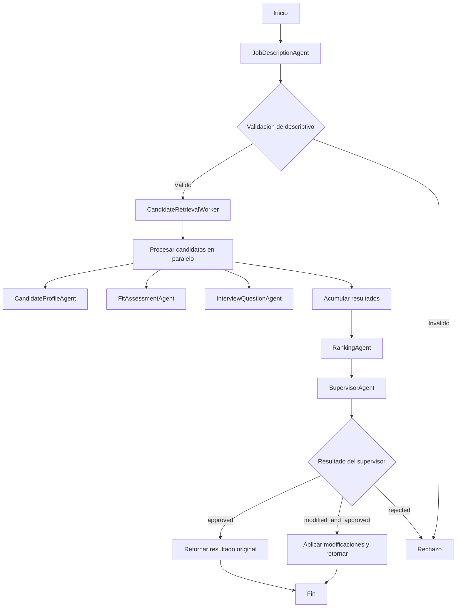

# FitAnalysisOrchestrator

Orquesta el análisis de compatibilidad entre un descriptivo de cargo y múltiples CV almacenados en un directorio.

## Flujo



## Uso

```bash
python agent.py --role-text "Descriptivo de cargo..." --cv-dir ./cvs --max-candidates 5 --weights '{"technical": 0.7}'
```

## Salida esperada

```json
{
  "analysis_id": "...",
  "role": {},
  "candidates_analyzed": 0,
  "ranking": [],
  "supervisor_result": {},
  "traces": [],
  "total_latency_ms": 0,
  "total_tokens": 0,
  "status": "completed"
}
```
